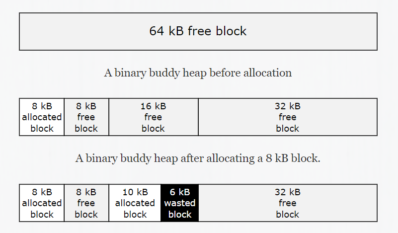

# Buddy-System Memory Allocation With Virtual Memory

This is the repository of our implementation of Buddy-System memory allocation technique, which we did as COA mini-project in our Computer Engg. second year.

This was done by : Tejas Ghone, Vatsal Soni, Yashodhan Joshi, Yatharth Vyas.

### About

The buddy system is a memory allocation and management algorithm that manages memory in power of two increments. Assume the memory size is 2U, suppose a size of S is required.
If 2U-1 < S <= 2U : Allocate the whole block
Else: Recursively divide the block equally and test the condition at each time, when it satisfies, allocate the block and get out the loop.

Buddy allocation system is an algorithm in which a larger memory block is divided into small parts to satisfy the request. This algorithm is used to give best fit. The two smaller parts of block are of equal size and called as buddies. In the same manner one of the two buddies will further divide into smaller parts until the request is fulfilled. Benefit of this technique is that the two buddies can combine to form the block of larger size according to the memory request.

Example:

- We have single memory block of 64 kB.
- If the application requests a block of 8 kB, the allocator would check its 8 kB free list and find no free blocks of that size. It would then split the 64 kB block into two block of 32 kB, split one of them into two blocks of 16 kB, and split one of them into two blocks of 8 kB.
- The allocator would then return one of the 8 kB blocks to the application and keep the remaining three blocks of 8 kB, 16 kB, and 32 kB on the appropriate free lists.
- If the application then requested a block of 10 kB, the allocator would round this request up to 16 kB, and return the 16 kB block from its free list, wasting 6 kB in the process.

### Implementation and efficiency

In comparison to other simpler techniques such as dynamic allocation, the buddy memory system has little external fragmentation, and allows for compaction of memory with little overhead. The buddy method of freeing memory is fast, with the maximal number of compactions required equal to log2(highest order). The downside is that it can cause a lot of internal fragmentation, as the memory must be allocated in sizes which are powers of 2. Thus , even if required memory is 65 bytes (64+1), the allocation will be done of size 128 bytes, and if requirement is of 129 bytes, i.e. (128+1), the allocation will be of 256 bytes, which can cause a lot of internal fragmentation and wastage of memory.

Typically the buddy memory allocation system is implemented with the use of a binary tree to represent used or unused split memory blocks. In this implementation, we have directly used a contiguous block of memory to represent the total memory available, and then used linked list to represent the 'holes' or free memory space available. The virtual memory is also implemented using a linked list.

Our main API is as follows :

### buddy-system.c :

<ul>
<li>void make_mem(int max_size) : Init Function for memory. Must Be called before alloc or delloc.</li>
<li>int allocate_page(int pid, int size) : function to allocate memory. Note that this does notreturn pointer to memory, only if the allocation was successful (0) or not (-1). This may allocate the process memory from the main memory if available, or store it in virtual memory, if main memory does not have enough space.</li>
<li>int free_page(int pid) : function to de-allocate memory.</li>
<li> void *get_process(int pid) : Function to actually get a pointer of the memory allocated. <strong>Note that this must be called every time beofore the allocated memory is to be used</strong>, as if the data was stored in virtual memory, this will swap out data from main memory to virtual memory to make space, then bring in the enquired process data into main memory and then return that pointer.</li>
<li>void print_stat() : print status of main and virtual memory to STDOUT</li>
</ul>

### Notes :

This is primarily a proof-of-concept project, and is niether optimized nor is best implementation for real usage.
